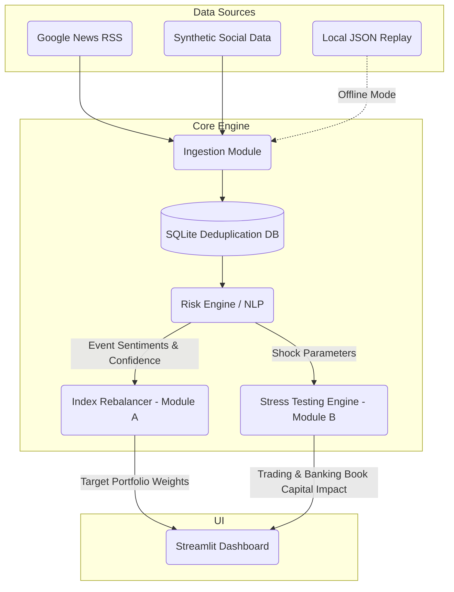

# System Architecture

This diagram illustrates the separation of concerns between data ingestion, semantic event tracking, algorithmic portfolio rebalancing (Module A), and stress testing (Module B).
